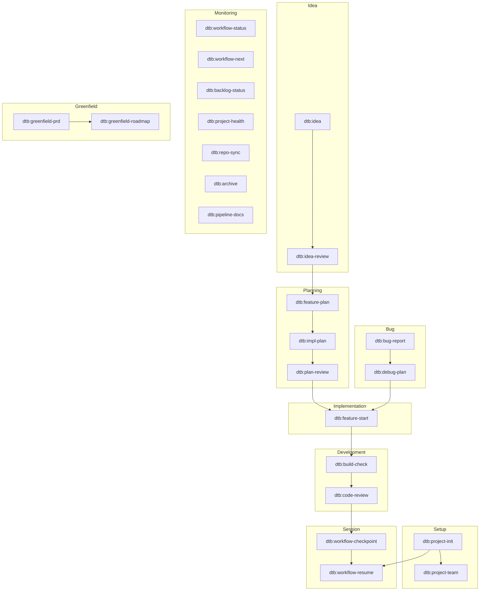

# Claude Code Workflow Kit — Pipeline & Artefakt-Uebersicht

> Diese Datei kann automatisch als interaktive HTML-Version generiert werden: `/dtb:pipeline-docs`

## Pipeline-Visualisierung



---

## Hauptpipeline

```
Feature: project-init → idea → idea-review → feature-plan → impl-plan → plan-review → feature-start → build-check → code-review → workflow-checkpoint → workflow-resume
Bug:     bug-report → debug-plan → feature-start → build-check → code-review → workflow-checkpoint → workflow-resume
```

Die Bug-Pipeline muendet bei `feature-start` in die Feature-Pipeline ein. Die Monitoring-Skills (`workflow-next`, `workflow-status`, `backlog-status`, `project-health`, `repo-sync`, `archive`) stehen seitlich — sie lesen quer ueber alle Artefakte, greifen aber nicht in die Pipeline ein.

---

## Skill-Artefakt-Matrix

Wer liest was, wer schreibt was:

```
                          CONFIG INBOX BACKLOG FEATURE PLAN BUG  WF_STATUS SESSION TEAM ARCHIVE AGENTS PRD ROADMAP CLAUDE RULES
                          ────── ───── ─────── ─────── ──── ──── ───────── ─────── ──── ─────── ────── ─── ─────── ────── ─────
SETUP
  project-init            ✏️                                       ✏️                                              ✏️
  project-team            📖                                                         ✏️
  generate-rules          📖                                                                                 📖            ✏️

IDEA
  idea                           ✏️
  idea-review                    ✏️

BUG
  bug-report                            ✏️                ✏️
  debug-plan                                              ✏️

PLANNING
  feature-plan            📖     ✏️     ✏️       ✏️
  impl-plan                                      📖     ✏️
  plan-review                                    📖     📖                                       📖

IMPLEMENTATION
  feature-start                         ✏️       📖     📖  📖   ✏️

DEVELOPMENT
  build-check             📖
  code-review             📖                                                                                 📖     📖

SESSION
  workflow-checkpoint            📖     ✏️       ✏️                  ✏️
  workflow-resume                       📖       📖     📖       📖        📖

MONITORING
  workflow-next                   📖     📖       📖     📖  📖   📖
  workflow-status                📖     📖       📖     📖  📖   📖
  backlog-status                        📖       📖     📖  📖
  project-health          📖     📖     📖       📖     📖  📖   📖                                               📖     📖
  repo-sync               📖
  archive                        ✏️     ✏️       📖     📖  📖                      ✏️
  pipeline-docs

GREENFIELD
  greenfield-prd                                                                                     📖
  greenfield-roadmap                                                                                 📖    📖
```

`📖 = liest (consumes)` | `✏️ = schreibt (produces)`

---

## Artefakte und ihre Speicherorte

| Artefakt | Pfad (im Zielprojekt) | Beschreibung |
|----------|----------------------|--------------|
| `workflow.config.yaml` | Projekt-Root | Single Source of Truth fuer Projektconfig |
| `CLAUDE.md` | Projekt-Root | Projektkontext fuer Claude Code |
| `INBOX.md` | `dtb-project/project-workflows/` | Ideen-Inbox (schnelle Erfassung) |
| `BACKLOG.md` | `dtb-project/project-workflows/` | Feature-Backlog mit Priorisierung |
| `WORKFLOW_STATUS.md` | `dtb-project/project-workflows/` | Kompaktes Status-Dashboard (max 60-80 Zeilen) |
| `FEATURE_*.md` | `dtb-project/project-workflows/features/` | Feature-Spezifikationen (UPPER_SNAKE_CASE) |
| `BUG_*.md` | `dtb-project/project-workflows/features/` | Bug-Reports mit Severity und Status (UPPER_SNAKE_CASE) |
| `PLAN_*.md` | `dtb-project/project-workflows/features/` | Implementierungsplaene (gepaart mit FEATURE_*.md) |
| `session-log` | `dtb-project/project-changelog/YYYY-MM/YYYY-MM-DD.md` | Tages-Changelogs (append per Session) |
| `TEAM.md` | `dtb-project/project-strategy/` | Projektteam-Dokumentation |
| `ARCHIVE_LOG.md` | `dtb-project/project-workflows/archive/` | Log archivierter Eintraege |
| `project-rules/*.md` | `dtb-project/project-rules/` | Coding-Richtlinien pro Bereich/Technologie |
| `agents/*.md` | Projekt-Root | Agenten-Rollen (Architekt, Pragmatiker, Senior Dev) |
| `PRD-MVP.md` | `dtb-project/project-strategy/` | Product Requirements Document |
| `ROADMAP.md` | `dtb-project/project-strategy/` | Strategische Projekt-Roadmap |

---

## Skill-Uebersicht nach Stage

### Setup
| Skill | Beschreibung | Vorgaenger | Nachfolger |
|-------|-------------|------------|------------|
| `dtb:project-init` | Erstinitialisierung, Config + Verzeichnisse | — | `dtb:workflow-resume` |
| `dtb:project-team` | Projektteam dokumentieren | `dtb:project-init` | — |
| `dtb:generate-rules` | Coding-Richtlinien generieren | `dtb:project-init` | — |

### Idea
| Skill | Beschreibung | Vorgaenger | Nachfolger |
|-------|-------------|------------|------------|
| `dtb:idea` | Idee schnell in Inbox erfassen | — | `dtb:idea-review` |
| `dtb:idea-review` | Inbox-Ideen sichten und bewerten | `dtb:idea` | `dtb:feature-plan` |

### Bug
| Skill | Beschreibung | Vorgaenger | Nachfolger |
|-------|-------------|------------|------------|
| `dtb:bug-report` | Bug mit Severity erfassen | — | `dtb:debug-plan` |
| `dtb:debug-plan` | Root-Cause analysieren + Fix-Strategie | `dtb:bug-report` | `dtb:feature-start` |

### Planning
| Skill | Beschreibung | Vorgaenger | Nachfolger |
|-------|-------------|------------|------------|
| `dtb:feature-plan` | Feature-Spezifikation erstellen | `dtb:idea-review` | `dtb:impl-plan` |
| `dtb:impl-plan` | Implementierungsplan erstellen | `dtb:feature-plan` | `dtb:plan-review` |
| `dtb:plan-review` | Plan-Review mit 3 Agenten-Perspektiven | `dtb:impl-plan` | `dtb:feature-start` |

### Implementation
| Skill | Beschreibung | Vorgaenger | Nachfolger |
|-------|-------------|------------|------------|
| `dtb:feature-start` | Feature aus Backlog starten | `dtb:plan-review` | `dtb:build-check` |

### Development
| Skill | Beschreibung | Vorgaenger | Nachfolger |
|-------|-------------|------------|------------|
| `dtb:build-check` | Build/Test-Checks ausfuehren | `dtb:feature-start` | `dtb:code-review` |
| `dtb:code-review` | Code-Review gegen Projekt-Richtlinien | `dtb:build-check` | `dtb:workflow-checkpoint` |

### Session
| Skill | Beschreibung | Vorgaenger | Nachfolger |
|-------|-------------|------------|------------|
| `dtb:workflow-checkpoint` | Session dokumentieren + Status aktualisieren | — | `dtb:workflow-resume` |
| `dtb:workflow-resume` | Session-Kontext wiederherstellen | `dtb:workflow-checkpoint` | — |

### Monitoring (read-only, kein Pipeline-Flow)
| Skill | Beschreibung |
|-------|-------------|
| `dtb:workflow-next` | Konkreter naechster Schritt pro aktivem Feature |
| `dtb:workflow-status` | Pipeline-Visualisierung mit Queue-Analyse |
| `dtb:backlog-status` | Backlog-Uebersicht mit Priorisierung |
| `dtb:project-health` | Projekt-Linting (10 Check-Kategorien) |
| `dtb:repo-sync` | Git-Status aller Repos + Cross-Repo-Check |
| `dtb:archive` | Abgeschlossene/verworfene Eintraege archivieren |
| `dtb:pipeline-docs` | Interaktive HTML-Uebersicht des Skill-Systems generieren |

### Greenfield
| Skill | Beschreibung | Vorgaenger | Nachfolger |
|-------|-------------|------------|------------|
| `dtb:greenfield-prd` | PRD-Zusammenfassung | — | `dtb:greenfield-roadmap` |
| `dtb:greenfield-roadmap` | Roadmap-Uebersicht mit Fortschritt | `dtb:greenfield-prd` | — |
