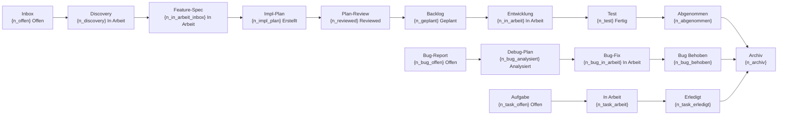

# DTB Workflow-Status

Read-Only Pipeline-Visualisierung: Zeigt alle Workflow-Stufen, Queue-Depths, beteiligte Skills/Agents und Engpass-Analyse.

## Schritt 0: Config laden

Lies `workflow.config.yaml` im Projekt-Root.

Falls nicht vorhanden: Verwende Fallback-Pfad `dtb-project/project-workflows/`.

## Schritt 1: Artefakte zaehlen (abgeleitet)

**Ableitungsregel:** Alle Stufen-Zaehlungen werden aus Artefakten ABGELEITET, nicht aus
Statusfeldern uebernommen — verbindliche Regeln in `{config.paths.rules}/DERIVED_STATE_RULES.md`
(Fallback: `dtb-project/project-rules/DERIVED_STATE_RULES.md`). Lies diese Datei zuerst.
Statusfelder (BACKLOG.md, `**Status:**`-Zeilen) dienen nur der Konflikterkennung;
Ausnahme: explizite Zustaende `Pausiert`/`Abgenommen` (Regel-Datei §1.2).

Scanne alle relevanten Dateien und zaehle Items pro Stufe:

**INBOX.md** (`{config.paths.workflows}/INBOX.md`):
- Zaehle Eintraege nach Status: `Offen`, `In Arbeit`, `Ausgearbeitet`, `Verworfen`
- Nur `Offen` und `In Arbeit` sind Pipeline-relevant (INBOX-Status wird von den
  Idea-Skills gepflegt und gilt als Artefakt-Zustand)

**discovery.md** (`{config.paths.workflows}/features/*/discovery.md`):
- Zaehle vorhandene Discovery-Dateien
- Lies jeweils den `**Status:**`-Wert (Abgeschlossen = fertig fuer Feature-Spec)

**spec.md + plan.md** (`{config.paths.workflows}/features/*/`) — Kern der Ableitung:
- `spec.md` ohne `plan.md` → Stufe "Spezifiziert" (= Feature-Spec ohne Plan)
- `plan.md` Kopf-Statusfeld `Entwurf` **und** `## Progress` 0/Y → wartend auf Review
  (Checkbox-Guard §7.3: bei abgehaktem Progress gewinnen die Progress-Zeilen unten)
- `plan.md` Kopf-Statusfeld `Reviewed`, `## Progress` 0/Y abgehakt → bereit fuer Start ("Geplant")
- **Kopf-Statusfeld lesen (Regel-Datei §7):** nur die `**Status:**`-Zeile in den ersten 10 Zeilen
  (Definitionsfenster §7.1), davon nur das **erste Wort** (Parse-Regel §7.1 — Klammer-Vermerk
  und HTML-Kommentar sind Annotation). Lese-Toleranz §7.3: Feld fehlt oder liegt ausserhalb →
  wie `Entwurf`, still; Altwerte `In Umsetzung`/`Abgeschlossen` → wie `Reviewed`, still;
  unbekannter Wert → wie fehlend + 1 Hinweiszeile.
  **Wartungs-Hinweis (Format-Kopplung):** spiegelt §7.3 (Kopie ist Absicht, INBOX #22) —
  Aenderung dort hier mitziehen
- `plan.md` `## Progress` teilweise abgehakt (X/Y) → "In Arbeit"
- `plan.md` `## Progress` vollstaendig abgehakt → "Fertig zum Testen"
- Fallbacks (Regel-Datei §1.4): `plan.md` ohne Progress-Sektion → "Fortschritt unbekannt"
  (eigene Zeile in Queue-Tabelle); flache Alt-Dateien/`IMPL_STATUS_*.md` → ignorieren, Migrations-Hinweis;
  Ordner mit `plan.md` ohne `spec.md` → "Change ohne Spec"

**BACKLOG.md** (`{config.paths.workflows}/BACKLOG.md`):
- NUR fuer Prio-Werte und Konflikterkennung lesen — Zaehlungen kommen aus der Ableitung oben
- Weicht ein BACKLOG-Status vom abgeleiteten Zustand ab: Konflikt vormerken (Schritt 6)

**bug.md** (`{config.paths.workflows}/features/*/bug.md`) — abgeleitet:
- kein Analyse-Abschnitt → `Offen`; Analyse vorhanden, 0 `## Fix-Schritte` abgehakt → `Analysiert`
- Fix-Schritte teilweise abgehakt → `In Arbeit`; alle abgehakt → `Behoben`

**task.md** (`{config.paths.workflows}/features/*/task.md`) — abgeleitet:
- `## Schritte` 0 abgehakt → `Offen`; teilweise → `In Arbeit`; alle → `Erledigt`

**WORKFLOW_STATUS.md** (`{config.paths.workflows}/WORKFLOW_STATUS.md`):
- Identifiziere aktuell laufende Arbeit (Sektion "Laufende Arbeit" o.ae.)

**Archiv** (`{config.paths.workflows}/archive/ARCHIVE_LOG.md`):
- Falls vorhanden: Zaehle archivierte Eintraege

## Schritt 2: Quality Gates pro aktivem Feature pruefen

Fuer jedes Feature mit Status "In Arbeit" oder "Geplant" im Backlog: Pruefe welche Gates bestanden sind.

**Gate-Definitionen (in Reihenfolge):**

| Gate | Bestanden wenn |
|------|---------------|
| Discovery | `discovery.md` existiert mit Status `Abgeschlossen` |
| Feature-Spec | `spec.md` existiert |
| Impl-Plan | `plan.md` existiert |
| Plan-Review | Kopf-Statusfeld gilt als `Reviewed` (inkl. Altwert-Toleranz §7.3) |
| Verifikation | `## Progress`-Zeilen abgeschlossener Phasen tragen SHA-Beleg (Phasen-Ritual `dtb:implement`) |
| Impl-Review | `/dtb:impl-review` durchgefuehrt (aus Session-Log oder `features/{slug}/review.md` ablesen) |

**Symbole:**
- `[x]` = Gate bestanden
- `[ ]` = Gate offen
- `[-]` = Gate uebersprungen (z.B. Discovery nicht noetig wenn Feature direkt geplant)

Falls keine aktiven Features vorhanden: Sektion weglassen.

## Schritt 3: Mermaid-Flowchart generieren

Erstelle ein `flowchart LR` Diagramm mit einem Knoten pro Pipeline-Stufe. Jeder Knoten zeigt die Stufe und die Anzahl der Items als Label. Verwende die tatsaechlich gezaehlten Werte aus Schritt 1.

## Schritt 4: Queue-Tabelle generieren

Erstelle eine kompakte Tabelle mit den Spalten:
- **Stufe**: Name der Pipeline-Stufe
- **Anzahl**: Gezaehlte Items
- **Wartend**: Aeltester Eintrag oder `—` wenn leer
- **Naechster Skill**: Welcher `/dtb:*` Skill als naechstes greift

## Schritt 5: Skills & Agents Tabelle

Zeige welche Skills und Agents an welchem Uebergang beteiligt sind (statische Referenz).

## Schritt 6: Engpass- & Konflikt-Analyse

Identifiziere wo sich Items stauen:
- Welche Stufe hat die meisten wartenden Items?
- Gibt es Stufen mit Items aber ohne nachfolgende Aktivitaet?
- Konkrete Empfehlung welcher Skill als naechstes ausgefuehrt werden sollte

Melde vorgemerkte Konflikte (Regel-Datei §1.3): pro Widerspruch 1 Hinweiszeile
(`⚠ {Quelle} sagt "{Feld}", Artefakte zeigen "{abgeleitet}"`) — das Artefakt gewinnt,
Felder werden NICHT korrigiert (read-only).

Gleiches gilt fuer den **Feld-Konflikt am `plan.md`-Kopf** (§7.3): widerspricht das
Kopf-Statusfeld dem `## Progress`-Stand, 1 Hinweiszeile
`⚠ plan.md-Kopf sagt "{Wert}", ## Progress zeigt "{X/Y}"` — Pfleger ist `dtb:plan-review` (§7.2),
dieser Skill korrigiert nichts.

## Output-Format

Gib den Report direkt in der Konsole aus (keine Datei schreiben). Verwende folgendes Template mit den tatsaechlich gezaehlten Werten:

```markdown
# Workflow-Status: {project_name}
**Datum:** YYYY-MM-DD

## Pipeline



## Quality Gates (aktive Features)

| Feature | Discovery | Spec | Plan | Review | Build | Impl-Review |
|---------|-----------|------|------|--------|-------|-------------|
| {Feature-Name} | [x] | [x] | [x] | [ ] | [ ] | [ ] |

{Falls kein Gate offen: "Alle Gates bestanden — bereit fuer Abnahme."}
{Falls Gates offen: "Naechstes offenes Gate: {Gate-Name} → /dtb:{skill}"}

## Queue-Details

| Stufe | Anzahl | Wartend | Naechster Skill |
|-------|--------|---------|-----------------|
| Inbox (Offen) | {n} | {aeltester} | `/dtb:idea-review` |
| Inbox (In Arbeit) | {n} | {aeltester} | `/dtb:feature-discover` |
| Discovery | {n} | {aeltester} | `/dtb:feature-plan` |
| Feature-Spec (ohne Plan) | {n} | {aeltester} | `/dtb:impl-plan` |
| Impl-Plan (Entwurf, 0/Y) | {n} | {aeltester} | `/dtb:plan-review` |
| Backlog (Geplant) | {n} | {aeltester} | `/dtb:feature-start` |
| In Arbeit | {n} | {aeltester} | `/dtb:implement` |
| Fertig zum Testen | {n} | {aeltester} | — |
| Abgenommen | {n} | {aeltester} | `/dtb:workflow-checkpoint` |
| **Bug-Pipeline** | | | |
| Bugs (Offen) | {n} | {aeltester} | `/dtb:debug-plan` |
| Bugs (Analysiert) | {n} | {aeltester} | `/dtb:feature-start` |
| Bugs (In Arbeit) | {n} | {aeltester} | `/dtb:implement` |
| Bugs (Behoben) | {n} | {aeltester} | `/dtb:archive` |
| **Aufgaben-Pipeline** | | | |
| Aufgaben (Offen) | {n} | {aeltester} | `/dtb:feature-start` |
| Aufgaben (In Arbeit) | {n} | {aeltester} | Weiterarbeiten |
| Aufgaben (Erledigt) | {n} | {aeltester} | `/dtb:archive` |
| Archiv | {n} | — | — |

## Beteiligte Skills & Agents

| Uebergang | Skill | Agent |
|-----------|-------|-------|
| Idee erfassen | `/dtb:idea` | — |
| Idee bewerten | `/dtb:idea-review` | — |
| Bug erfassen | `/dtb:bug-report` | — |
| Bug analysieren | `/dtb:debug-plan` | — |
| Aufgabe erfassen | `/dtb:task` | — |
| Feature Discovery | `/dtb:feature-discover` | — |
| Feature planen | `/dtb:feature-plan` | — |
| Impl-Plan erstellen | `/dtb:impl-plan` | — |
| Plan reviewen | `/dtb:plan-review` | Architekt, Pragmatiker, Senior Dev |
| Feature starten | `/dtb:feature-start` | — |
| Umsetzung + Verifikation | `/dtb:implement` | — |
| Session sichern | `/dtb:workflow-checkpoint` | — |
| Archivieren | `/dtb:archive` | — |

## Engpass

{Wo stauen sich die meisten Items? Empfehlung welcher Skill als naechstes sinnvoll waere.}
```

## Richtlinien

- **Read-Only**: Dieser Skill aendert keine Dateien
- **Kompakt**: Max 90 Zeilen Output (Quality Gates nur bei aktiven Features zeigen)
- **Deutsch**: Alle Texte auf Deutsch
- **Doppel-Format**: Mermaid-Diagramm fuer visuelle Darstellung, Tabelle als Fallback
- **Actionable**: Konkrete Empfehlung am Ende

## Verwandte Skills

- `/dtb:workflow-next` — Konkreter naechster Schritt pro Feature
- `/dtb:backlog-status` — Backlog-Details
- `/dtb:project-health` — Projekt-Audit
- `/dtb:workflow-resume` — Session fortsetzen

---

Scanne jetzt die Workflow-Dateien und erstelle die Pipeline-Visualisierung.
