# DTB Workflow-Status

Read-Only Pipeline-Visualisierung: Zeigt alle Workflow-Stufen, Queue-Depths, beteiligte Skills/Agents und Engpass-Analyse.

## Schritt 0: Config laden

Lies `workflow.config.yaml` im Projekt-Root.

Falls nicht vorhanden: Verwende Fallback-Pfad `dtb-project/project-workflows/`.

## Schritt 1: Artefakte zaehlen

Scanne alle relevanten Dateien und zaehle Items pro Stufe:

**INBOX.md** (`{config.paths.workflows}/INBOX.md`):
- Zaehle Eintraege nach Status: `Offen`, `In Arbeit`, `Ausgearbeitet`, `Verworfen`
- Nur `Offen` und `In Arbeit` sind Pipeline-relevant

**DISCOVERY_*.md** (`{config.paths.workflows}/features/DISCOVERY_*.md`):
- Zaehle vorhandene Discovery-Dateien
- Lies jeweils den `**Status:**`-Wert (Abgeschlossen = fertig fuer Feature-Spec)

**BACKLOG.md** (`{config.paths.workflows}/BACKLOG.md`):
- Zaehle Features nach Status: `Geplant`, `In Arbeit`, `Fertig zum Testen`, `Abgenommen`, `Abgeschlossen`

**FEATURE_*.md** (`{config.paths.workflows}/features/FEATURE_*.md`):
- Lies jeweils den `**Status:**`-Wert aus den ersten 20 Zeilen
- Verwende als Gegenprobe zu BACKLOG.md

**PLAN_*.md** (`{config.paths.workflows}/features/PLAN_*.md`):
- Lies jeweils den `**Status:**`-Wert aus den ersten 10 Zeilen (Entwurf / Reviewed / In Umsetzung / Abgeschlossen)
- Zaehle Features ohne PLAN_*.md (= "Feature-Spec ohne Plan")
- Zaehle PLAN_*.md mit Status "Entwurf" (= wartend auf Review)
- Zaehle PLAN_*.md mit Status "Reviewed" (= bereit fuer Backlog/Start)

**WORKFLOW_STATUS.md** (`{config.paths.workflows}/WORKFLOW_STATUS.md`):
- Identifiziere aktuell laufende Arbeit (Sektion "Laufende Arbeit" o.ae.)

**Archiv** (`{config.paths.workflows}/archive/ARCHIVE_LOG.md`):
- Falls vorhanden: Zaehle archivierte Eintraege

## Schritt 2: Mermaid-Flowchart generieren

Erstelle ein `flowchart LR` Diagramm mit einem Knoten pro Pipeline-Stufe. Jeder Knoten zeigt die Stufe und die Anzahl der Items als Label. Verwende die tatsaechlich gezaehlten Werte aus Schritt 1.

## Schritt 3: Queue-Tabelle generieren

Erstelle eine kompakte Tabelle mit den Spalten:
- **Stufe**: Name der Pipeline-Stufe
- **Anzahl**: Gezaehlte Items
- **Wartend**: Aeltester Eintrag oder `—` wenn leer
- **Naechster Skill**: Welcher `/dtb:*` Skill als naechstes greift

## Schritt 4: Skills & Agents Tabelle

Zeige welche Skills und Agents an welchem Uebergang beteiligt sind (statische Referenz).

## Schritt 5: Engpass-Analyse

Identifiziere wo sich Items stauen:
- Welche Stufe hat die meisten wartenden Items?
- Gibt es Stufen mit Items aber ohne nachfolgende Aktivitaet?
- Konkrete Empfehlung welcher Skill als naechstes ausgefuehrt werden sollte

## Output-Format

Gib den Report direkt in der Konsole aus (keine Datei schreiben). Verwende folgendes Template mit den tatsaechlich gezaehlten Werten:

```markdown
# Workflow-Status: {project_name}
**Datum:** YYYY-MM-DD

## Pipeline

```mermaid
flowchart LR
    INBOX["Inbox\n{n_offen} Offen"] --> DISC["Discovery\n{n_discovery} In Arbeit"]
    DISC --> SPEC["Feature-Spec\n{n_in_arbeit_inbox} In Arbeit"]
    SPEC --> IMPL["Impl-Plan\n{n_impl_plan} Erstellt"]
    IMPL --> REVIEW["Plan-Review\n{n_reviewed} Reviewed"]
    REVIEW --> BACKLOG["Backlog\n{n_geplant} Geplant"]
    BACKLOG --> DEV["Entwicklung\n{n_in_arbeit} In Arbeit"]
    DEV --> TEST["Test\n{n_test} Fertig"]
    TEST --> DONE["Abgenommen\n{n_abgenommen}"]
    DONE --> ARCHIV["Archiv\n{n_archiv}"]
```



## Queue-Details

| Stufe | Anzahl | Wartend | Naechster Skill |
|-------|--------|---------|-----------------|
| Inbox (Offen) | {n} | {aeltester} | `/dtb:idea-review` |
| Inbox (In Arbeit) | {n} | {aeltester} | `/dtb:feature-discover` |
| Discovery | {n} | {aeltester} | `/dtb:feature-plan` |
| Feature-Spec (ohne Plan) | {n} | {aeltester} | `/dtb:impl-plan` |
| Impl-Plan (Entwurf) | {n} | {aeltester} | `/dtb:plan-review` |
| Backlog (Geplant) | {n} | {aeltester} | `/dtb:feature-start` |
| In Arbeit | {n} | {aeltester} | `/dtb:build-check` |
| Fertig zum Testen | {n} | {aeltester} | — |
| Abgenommen | {n} | {aeltester} | `/dtb:workflow-checkpoint` |
| Archiv | {n} | — | — |

## Beteiligte Skills & Agents

| Uebergang | Skill | Agent |
|-----------|-------|-------|
| Idee erfassen | `/dtb:idea` | — |
| Idee bewerten | `/dtb:idea-review` | — |
| Feature Discovery | `/dtb:feature-discover` | — |
| Feature planen | `/dtb:feature-plan` | — |
| Impl-Plan erstellen | `/dtb:impl-plan` | — |
| Plan reviewen | `/dtb:plan-review` | Architekt, Pragmatiker, Senior Dev |
| Feature starten | `/dtb:feature-start` | — |
| Build/Test | `/dtb:build-check` | — |
| Session sichern | `/dtb:workflow-checkpoint` | — |
| Archivieren | `/dtb:archive` | — |

## Engpass

{Wo stauen sich die meisten Items? Empfehlung welcher Skill als naechstes sinnvoll waere.}
```

## Richtlinien

- **Read-Only**: Dieser Skill aendert keine Dateien
- **Kompakt**: Max 80 Zeilen Output
- **Deutsch**: Alle Texte auf Deutsch
- **Doppel-Format**: Mermaid-Diagramm fuer visuelle Darstellung, Tabelle als Fallback
- **Actionable**: Konkrete Empfehlung am Ende

## Verwandte Skills

- `/dtb:backlog-status` — Backlog-Details
- `/dtb:project-health` — Projekt-Audit
- `/dtb:workflow-resume` — Session fortsetzen

---

Scanne jetzt die Workflow-Dateien und erstelle die Pipeline-Visualisierung.
